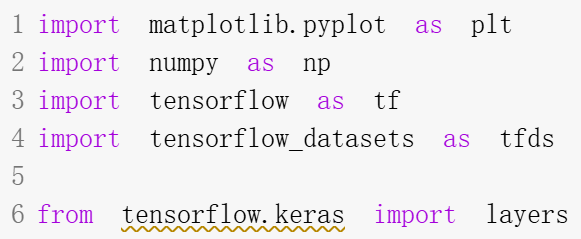

113-1南華大學跨領域-人工智慧 主題:數據增強
--------------------------------------------------------------------
#### 跨領域-人工智慧期末報告 組員:11124110 高儒彥 11124136 王何儀

數據增強：一種透過應用隨機（但真實）的變換（例如影像旋轉）來增加訓練集多樣性的技術。我們將學習如何透過兩種方式應用數據增強：
使用Keras 預處理層，例如tf.keras.layers.Resizing、tf.keras.layers.Rescaling、tf.keras.layers.RandomFlip和tf.keras.layers.RandomRotation。
使用tf.image方法，例如tf.image.flip_left_right、tf.image.rgb_to_grayscale、tf.image.adjust_brightness、tf.image.central_crop和tf.image.stateless_random*

設定

