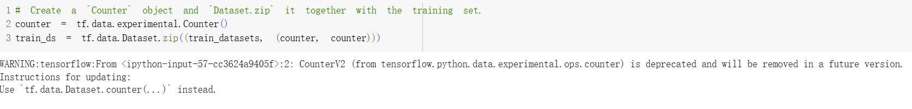

113-1南華大學跨領域-人工智慧 主題:數據增強
--------------------------------------------------------------------
#### 跨領域-人工智慧期末報告 組員:11124110 高儒彥 11124136 王何儀

數據增強：一種透過應用隨機（但真實）的變換（例如影像旋轉）來增加訓練集多樣性的技術。我們將學習如何透過兩種方式應用數據增強：
使用Keras 預處理層，例如tf.keras.layers.Resizing、tf.keras.layers.Rescaling、tf.keras.layers.RandomFlip和tf.keras.layers.RandomRotation。
使用tf.image方法，例如tf.image.flip_left_right、tf.image.rgb_to_grayscale、tf.image.adjust_brightness、tf.image.central_crop和tf.image.stateless_random*

設定

下載數據集
教程使用tf_flowers資料集。為了方便起見，請使用TensorFlow Datasets下載資料集。

花卉數據集有五個類

我們從數據集中檢索一個影像，然後使用它來演示資料增強。

使用Keras 預處理層
調整大小和重新縮放
使用Keras 預處理圖層將影像大小調整為一致的形狀（使用tf.keras.layers.Resizing），並重新調整像素值（使用tf.keras.layers.Rescaling）。

注意：上面的重新縮放圖層將像素值標準化到[0,1]範圍。如果想要[-1,1]，可以寫tf.keras.layers.Rescaling(1./127.5, offset=-1)。
可以看到將這些圖層應用於影像的結果。

驗證像素是否在[0, 1]範圍內：

數據增強
可以使用Keras 預處理層進行數據增強，例如tf.keras.layers.RandomFlip和tf.keras.layers.RandomRotation。
我們來建立一些預處理層，然後將它們重複應用於相同影像。

有多種預處理層可用於數據增強，包括tf.keras.layers.RandomContrast、tf.keras.layers.RandomCrop、tf.keras.layers.RandomZoom等。

使用Keras 預處理層的兩個選項
您可以透過兩種方式使用這些預處理層，但需進行重要的權衡。
選項1：使預處理層成為模型的一部分

在這種情況下，需要注意兩個要點：
資料增強將與其他層在裝置端同步運行，並受益於GPU 加速。
使用model.save匯出模型時，預處理層將與模型的其他部分一起儲存。如果稍後部署此模型，它將自動標準化映像（根據您的層配置）。這可以省去在伺服器端重新實作該邏輯的工作。
注意：資料增強在測試時處於停用狀態，因此只有在呼叫Model.fit（而非Model.evaluate或Model.predict）期間才會對輸入影像進行增強。

選項2：將預處理層應用於資料集

透過這種方式，您可以使用Dataset.map建立產生增強影像批次的資料集。在本例中：
資料增強將在CPU 上非同步進行，且為非阻塞性。您可以使用Dataset.prefetch將GPU 上的模型訓練與資料資料預處理重疊，如下所示。
在本例中，當呼叫Model.save時，預處理層將不會隨模型一起匯出。在保存模型或在伺服器端重新實作它們之前，您需要將它們附加到模型上。訓練後，您可以在匯出之前附加預處理層。

將預處理層應用於資料集
使用上面建立的Keras 預處理層配置訓練數據集、數據資料集和測試數據集。您還將配置數據集以提高效能，具體方式是使用並行讀取和緩衝預提取從磁碟產生批次，這樣不會阻塞I/O。 （您可以透過使用tf.data API 提高效能指南來詳細了解資料集效能）。
註：應僅對訓練集應用數據增強。

訓練模型
為了完整起見，您現在將使用剛剛準備的數據集訓練模型。
序貫模型由三個卷積塊( tf.keras.layers.Conv2D) 組成，每個卷積塊都有一個最大池化層( tf.keras.layers.MaxPooling2D)。有一個全連接層( tf.keras.layers.Dense)，上面有128 個單元，由ReLU 激活函數( 'relu') 激活。此模型尚未針對準確率進行調整（目標是展示機制）。

選擇tf.keras.optimizers.Adam最佳化器和tf.keras.losses.SparseCategoricalCrossentropy損失函數。若要查看每個訓練週期的訓練和驗證準確率，請將metrics參數傳遞給Model.compile。

訓練幾個週期：

自訂數據增強
也可以建立自訂數據增強層。
教程的這一部分展示了兩種操作方式：
首先，建立一個tf.keras.layers.Lambda層。這是編寫簡潔程式碼的好方式。
接下來，將透過子類化編寫一個新層，這會給您更多的控制。
兩個層都會根據某種機率隨機反轉影像中的顏色。

接下來，透過子類化實現自訂層：

使用tf.image
上述Keras 預訓練實用工具十分方便。但為了更精細的控制，您可以使用tf.data和tf.image編寫自己的資料增強管線或資料增強層。您也可以查看TensorFlow Addons 影像：運算和TensorFlow I/O：色彩空間轉換。
由於花卉資料集之前已經配置了資料增強，因此我們將其重新導入以重新開始。

檢索一個影像以供使用：

我們來使用以下函數呈現原始影像和增強影像，然後並排比較。

數據增強

翻轉影像
使用tf.image.flip_left_right垂直或水平翻轉影像：

您可以使用tf.image.rgb_to_grayscale對影像進行灰階處理：

調整影像飽和度
使用tf.image.adjust_saturation，透過提供飽和係數來調整影像飽和度：

更改影像亮度
使用tf.image.adjust_brightness，透過提供亮度係數來更改圖像的亮度：

對影像進行中心裁剪
使用tf.image.central_crop將影像從中心裁切到所需部分：

旋轉影像
使用tf.image.rot90將影像旋轉90 度：

隨機變換
警告：有兩組隨機圖像運算：tf.image.random*和tf.image.stateless_random*。強烈不建議使用tf.image.random*運算，因為它們使用的是TF 1.x 中的舊RNG。請改用本教學中介紹的隨機圖像運算。有關詳情，請參閱隨機數產生。
對影像應用隨機變換可以進一步幫助泛化和擴展資料集。目前的tf.imageAPI 提供了8 個這樣的隨機影像運算(op)：
- `tf.image.stateless_random_brightness`
- `tf.image.stateless_random_contrast`
- `tf.image.stateless_random_crop`
- `tf.image.stateless_random_flip_left_right`
- `tf.image.stateless_random_flip_up_down`
- `tf.image.stateless_random_hue`
- `tf.image.stateless_random_jpeg_quality`
- `tf.image.stateless_random_saturation`
這些隨機圖像運算純粹是功能性的：輸出僅取決於輸入。這使得它們易於在高性能、確定性的輸入管線中使用。它們要求每一步都輸入一個seed值。給定相同的seed，無論被呼叫多少次，它們都會傳回相同的結果。
註：seed是形狀為(2,)的Tensor，其值為任意整數。

在以下部分中，您將：
  1.回顧使用隨機影像運算來變換影像的範例。
  2.示範如何將隨機變換應用於訓練資料集。

隨機更改影像亮度
透過提供亮度係數和seed，使用tf.image.stateless_random_brightness隨機變更image的亮度。亮度係數在[-max_delta, max_delta)範圍內隨機選擇，並與給定的seed相關聯。

隨機更改影像對比度
透過提供對比範圍和seed，使用tf.image.stateless_random_contrast隨機變更image的對比。對比範圍在區間[lower, upper]中隨機選擇，並與給定的seed相關聯。

隨機裁剪影像
透過提供目標size和seed，使用tf.image.stateless_random_crop隨機裁剪image。從image中裁剪出來的部分位於隨機選擇的偏移處，並與給定的seed相關聯。

對資料集應用增強
我們首先再次下載圖像資料集，以防它們在先前的部分中被修改

接下來，定義一個用於調整影像大小和重新縮放影像的效用函數。此函數將用於統一資料集中影像的大小和比例：

我們同時定義augment函數，該函數可以將隨機變換應用於影像。此函數將在下一步中用於資料集。

選項1：使用tf.data.experimental.Counter
建立一個tf.data.experimental.Counter()物件（我們稱之為counter)，並使用(counter, counter) Dataset.zip資料集。這將確保資料集中的每個影像都與一個基於counter的唯一值（形狀為(2,)）相關聯，稍後可以將其傳遞到augment函數，作為隨機變換的seed值。

將augment函數映射到訓練資料集：

選項2：使用tf.random.Generator
建立一個具有初始 值seed的tf.random.Generator物件。在同一個生成器物件上呼叫make_seeds函數會始終傳回一個新的、唯一的seed值。
定義一個封裝容器函數：1) 呼叫make_seeds函數；2) 將新產生的seed值傳遞給augment函數進行隨機變換。
注意：tf.random.Generator物件會將RNG 狀態儲存在tf.Variable中，這表示它可以儲存為檢查點或以SavedModel格式儲存。有關詳情，請參閱隨機數產生。

將封裝容器函數f對應到訓練資料集，並將resize_and_rescale函數對應到驗證集和測試集：

後續步驟
本教學示範了使用Keras 預處理層和tf.image進行資料增強。
若要了解如何在模型中包含預處理層，請參閱影像分類教學。
您可能也有興趣了解預處理層如何幫助您對文字進行分類，請參閱基本文字分類教學。
您可以在此指南中了解有關tf.data的更多信息，並且可以在這裡了解如何配置輸入流水線以提高性能。
